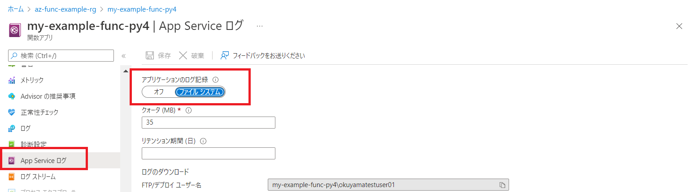
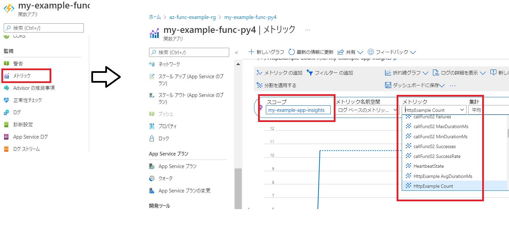
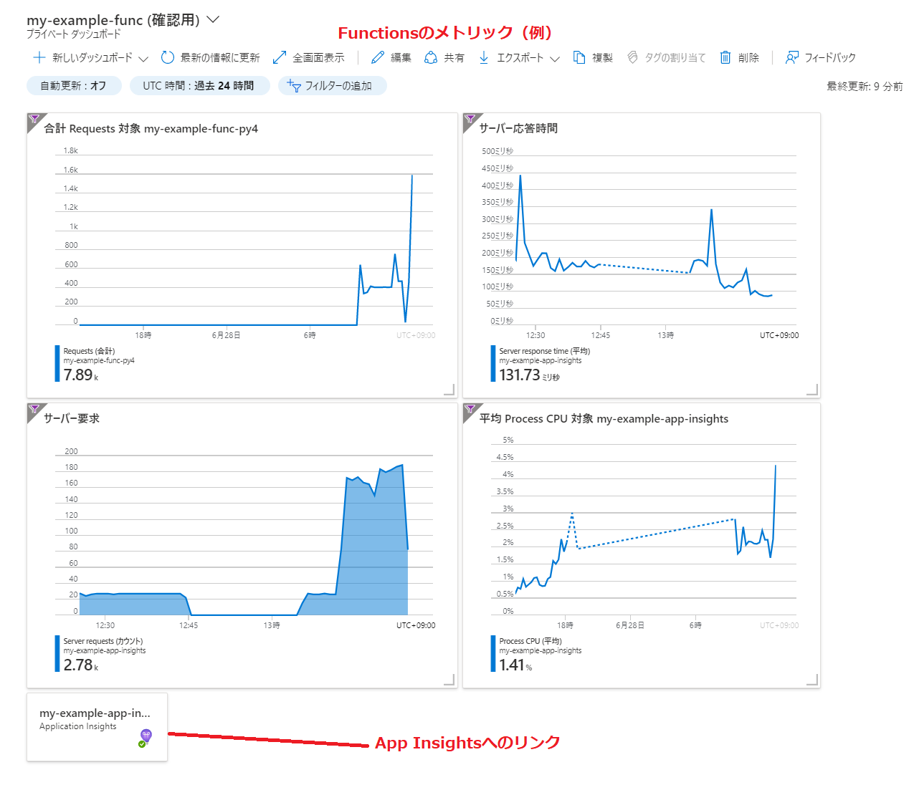

# Logging & Monitoring

Functions(Python)でのLogging, Monitoring について簡単に。

基本的にApplication Insights(ワークスペース ベース)を利用する。
※ワークスペース ベースではApplication Insights テレメトリを共通の Log Analytics ワークスペースに送信できる。ログを 1 つの統合された場所に保持できる。

## Azure Monitorについて (Azure の監視サービス)
Application Insights, Azure Monitor, Log Analytics, Worksace...　といろいろな言葉が出てきて紛らわしいので少し纏める。


Azure Monitorの概要は上記の図のようになっており、Application InsightsやLog Analytics などを含んでいる。

| サービス名 | 特徴 |
| --- | --- |
| Azure Monitor | 監視サービスの総称<br>Application InsightsやLog Analyticsを含んでいる。portal画面からアクセスできる<br>サービスによって多少ことなることがあるが共通している。<br>[概要][アクティビティ ログ]<br>[監視]セクション |
| Application Insights  | 製品のパフォーマンスのレベルを監視または測定し、エラーを診断する具体的な機能 |
| Log Analytics | Azure portalのツール<br> ログ クエリの編集と実行に使用する。|

(例) Azure Functions の場合の概要や監視、これらがAzure Monitorと呼ばれる機能になる。
  


## Application Insightsの設定

Application Insightsを利用します。
デフォルトではfunctionsと同じ名前で自動的にapp-insightsが作成される ※これはclassicタイプ

拡張機能の追加(az monitor app-insightsを利用するのに必要)
```
az extension add -n application-insights
```

ワークスペースベースのApplication Insightsを作成する
```
# workspaceの作成
az monitor log-analytics workspace create --resource-group $RG_NAME --workspace-name my-example-workspace

# app-insightsの作成
az monitor app-insights component create --app my-example-app-insights --location $LOCATION --kind web -g $RG_NAME --workspace "/subscriptions/$SUBSCRIPTION/resourcegroups/$RG_NAME/providers/microsoft.operationalinsights/workspaces/my-example-workspace"
```

Application Insightsを指定してfunctionの作成
```
az functionapp create <xxxxx>
```
※無効にしたい場合は `--disable-app-insights`
※既存のapp-insightsを利用する場合は `--app-insights` `--app-insights-key`

# Logging

## アプリケーションのログ

Applicationのログはlogging ハンドラーを介して出力する。
下記のようにログレベルを設定可能

```
import logging

import azure.functions as func

def main(req: func.HttpRequest) -> func.HttpResponse:

    logging.critical('This is logging.critical.')
    logging.error('This is logging.error.')
    logging.warning('This is logging.warning.')  
    logging.info('This is logging.info.')
    logging.debug('This is logging.debug.') #これは出力されない？？
```

exception(例外)もApplication Insightsで監視できるのでエラー処理に適切に利用する
```
raise ValueError("my error!")
```

## ログの確認


| -| 確認方法 |
| --- | --- |
| ログ |　tracesテーブル を KQLで検索 |
| ログ ストリーム | ポータルのストリーム画面<br>反応がわるいときがある。とくに従量課金プランの場合?。<br>errorログしか出力されていない。要確認 |

### ストリーム
ログをファイルシステムへ出力し、ログ ストリームで確認
(FileIOが発生するので高パフォーマンスを求められるシステムでは本番運用ではOffにする。)



CLI(コマンドラインツール)でのログをストリーミングすることも可能
従量課金プランの Linux 上で実行されているアプリでは、この方法を使用できない。
```
func azure functionapp logstream my-example-func-py4
Retrieving Function App...
2022-06-28T04:40:33  Welcome, you are now connected to log-streaming service.

Starting Log Tail -n 10 of existing logs ----
```

### Monitor Log (KQL)

KQLの基本的な利用方法だけ習得する。RDBのSQLのようにログを検索し表示することが可能。結果の集計や結合などを利用して円グラフや棒グラフとして表現することが可能。
作成したクエリは保存してダッシュボードに表示することができる。


### ログレベル(ログの量)の設定
host.json で調整可能
```
{
  "version": "2.0",
  "logging": {
    "logLevel": {
      "default":"Information"
    },
```
※公式のドキュメントでは以下のように定義されているが、Logを見ると少し違う？
```
Trace 0
Debug 1
Information 2
Warning 3
Error 4
Critical 5
None 6
```
## ログのサンプリング
テレメトリ データが生成されすぎないようにするサンプリング機能があります。
しきい値を超えると、受信したデータをランダムに無視する。
```
{
  "version": "2.0",
  "logging": {
    "applicationInsights": {
      "samplingSettings": {
        "isEnabled": false,
        "excludedTypes": "Request"
      }
    }
```

## カスタム テレメトリをログに記録する　★

★opencensus-python-extensions-azure(python用)の利用について調査中。。。
★OpenTelemetoryも調査


# Monitoring

Functionsのインスタンス数、CPU、メモリーなど基本的な項目を監視する。

## ポータルのメトリック(Azure Monitor)で確認
メモリ ワーキング セット、実行回数、CPU利用率などをAzure Monitorを利用して確認する


スコープにapp-insightsを選択すると、app-insightsに統合されているサービスのメトリックをすべて参照できる。

## Application Insightsで確認

アプリケーション マップ
各アプリケーションの連携をマップとして表示してくれます。エラーの情報も表示されるので分散/マイクロサービス アプリケーションの正常性の確認に便利です。


●ライブメトリック
ほぼリアルタイムでリクエスト数やサーバーの数を確認することが可能。


従量課金プランだとスケールアウトの設定を1にしても複数起動しているように見える

## 必要な情報をまとめてダッシュボードで監視する
(Functionsのメトリックをダッシュボードに纏めた例)

運用中だけでなく開発中も含めてメトリック(CPU, Memory,リクエスト数)を確認することは高頻度で行うことになります。開発中に必要なダッシュボードの作成をおこなっておくことでパフォーマンステストなどににも利用可能になるので必要なダッシュボードを開発中に作成しておくのがお勧め。

# Alert (Azure Monitorの機能)

ログやメトリックを監視してアラートを出す。

# Azure Monitorのコスト(料金)について

https://azure.microsoft.com/ja-jp/pricing/details/monitor/#pricing


## 取り込むデータに対して課金
| 価格レベル |　GB あたりの有効価格 |
| --- | --- |
| 従量課金制 | ¥424.598/GB |
| 100 GB/日 | ¥36,128.93/日 |
| 200 GB/日 | ¥67,833.90/日 |
| : | : |

確認方法 (Log Analytics ワークスペースのinsights)

確認方法 (Log Analytics 使用料と推定コスト)

## 保持
|機能|含まれている保持日数|料金|
| --- | --- | --- |
|データ保持|31 日間 (または Sentinel が有効になっている場合は 90 日間)、Application Insights データについては 90 日間| 1 GB あたり ¥19.069/月|

「ログ データのアーカイブと復元」、「ログ データのエクスポート」、「アラートルール」などにも料金が発生。
