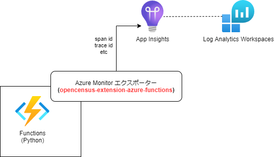
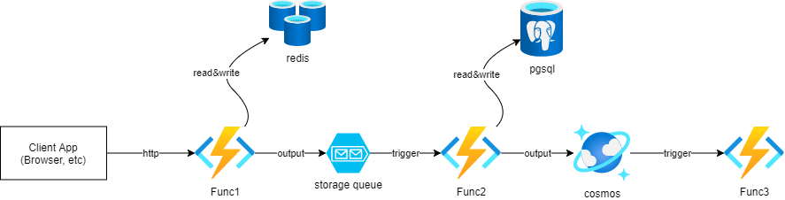

# Opencensusを使った分散トレーシング

## トレーシングとは
| - | 特徴|
| --- | --- |
| トレーシング | ミクロな情報、詳細な情報 |
| メトリック | マクロな情報、ざっくりとした情報  |

## 分散トレーシングとは

https://docs.microsoft.com/ja-jp/azure/azure-monitor/app/distributed-tracing

マイクロサービスアーキテクチャで構築されたアプリケーションを監視する仕組み。プロセスやシステムを跨いで監視できるようにする方法。マイクロサービス向け。

AzureのサービスとしてはAzure Monitorの「トランザクション診断ビュー」「アプリケーション マップ ビュー」が利用できる。

## opencensus-extension-azure-functions
Functionsでは拡張機能(opencensus-extension-azure-functions)を利用する。



## Azure リソースを作成


1. redis
```
az redis create --location $LOCATION --name my-example-rediscache --resource-group $RG_NAME --sku Basic --vm-size c0
```

2. storage queue
```
az storage queue create -n my-example-queue --metadata key1=value1 key2=value2 --account-name funcstorage0001
```

3. postgres sql
```
az postgres server create -l $LOCATION -g $RG_NAME -n my-example-pg-server -u myadmin -p Password@123 --sku-name GP_Gen5_2
az postgres db create -g $RG_NAME -s my-example-pg-server -n my-example-pg-db
```

4. cosmos db
```
az cosmosdb create --name my-example-cosmosdb-account --resource-group $RG_NAME --subscription $SUBSCRIPTION
```

## Functionsを実装

| 関数名 | trigger | inpurt | (処理) | output |
| :--- | :--: | :--: | :---: | :---: |
| func1 | http | query prame (my tx id) | redisへ書き込む | storage queue |
| func2 | storage queue | storage queue | postgresへ書き込む | cosmos db |
| func3 | cosmos db | N/A | ログ出力のみ | N/A |

```
PYTHON_ENABLE_WORKER_EXTENSIONS python 3.9 ではデフォルトで true (1)
```

★opencensus-python-extensions-azure(python用)の利用について調査中。。。
★できたらOpenTelemetoryも調査


## graphanaの利用