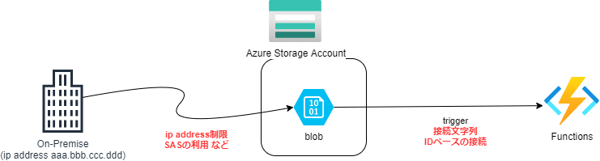
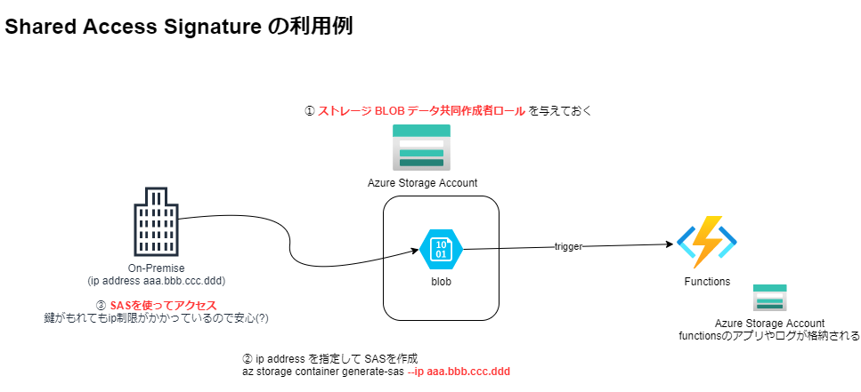
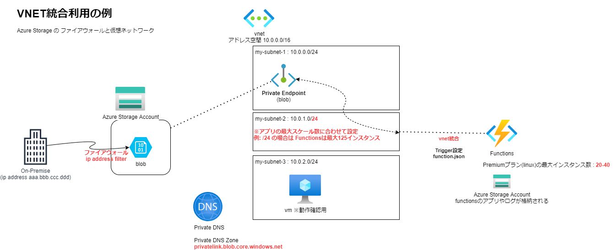
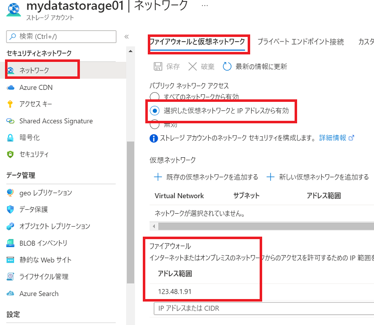
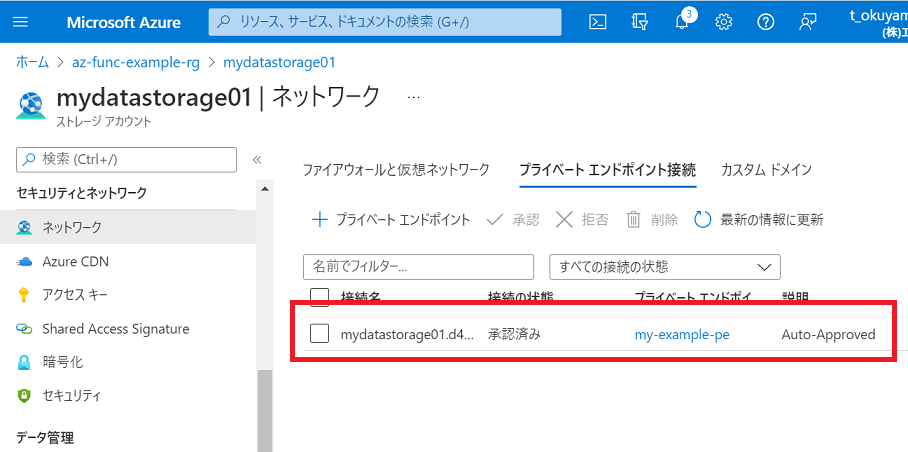
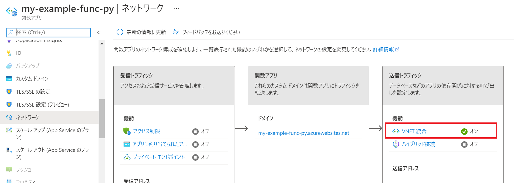
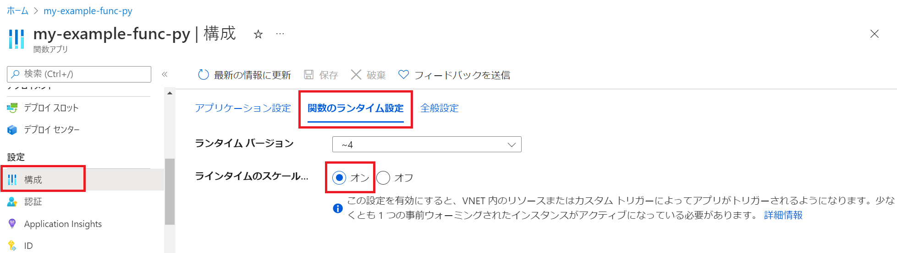

# Blob Trigger と アクセス制限

## 準備 : Storageアカウント mydatastorage01

Storageアカウントを作成
```
az storage account create -n mydatastorage01 -g $RG_NAME -l $LOCATION --sku Standard_LRS --kind StorageV2
az storage account show-connection-string -g $RG_NAME -n mydatastorage01
```

コンテナを作成
```
az storage container create --account-name mydatastorage01 -n samples-workitems
```

# Blob Triggerの設定について




## option 1 (アクセス キー)接続文字列

アプリ設定または設定コレクションの名前

## option 2 (ID ベースの接続)
シークレットを含む接続文字列の代わりとして利用できる

## option 3

Functionsの送信IPアドレスを固定する (NATゲートウェイ)
ネットワークの制限を入れる

---

# Shared Access signature (SAS)の利用
まず、SASには３種類ある

| SAS | 説明 | 備考 |
| --- | --- | --- |
| ユーザー委任のSAS | Azure ADの資格情報で保護<br>blob ストレージにのみ適用される | セキュリティーが一番高い<br>Microsoft推奨 |
| サービスSAS |ストレージアカウントキーで保護<br>blob,queue,table,filesのどれか一つだけのアクセスを委任する||
| アカウントSAS | ストレージアカウントキーで保護<br>blob,queue,table,filesの複数のアクセスを委任する<br>ストレージアカウントのShared Access Signatureから設定 | |

## ユーザー委任のSASを作成してアクセスする (Azure CLI)

NWレベルで全てのパブリックアクセスを許可した上で、オンプレ側からのアクセスについてはSASでグローバルIP制限をかけるようにする



(まとめ)
1. SASにIP制限を付けることで特定のクライアントからのアクセスに限定できる。
2. SASに期限を設定することで鍵が漏洩した場合でもある程度は安心
3. SASの発行を管理する必要がある　※クライアント自身で払い出すことも可能

ストレージ BLOB データ共同作成者ロールを割り当てる
```
az role assignment create \
    --role "Storage Blob Data Contributor" \
    --assignee t_okuyama@ap-com.co.jp \
    --scope "/subscriptions/$SUBSCRIPTION/resourceGroups/$RG_NAME/providers/Microsoft.Storage/storageAccounts/mydatastorage01"
```

コンテナー用のSASを作成
```
az storage container generate-sas \
    --account-name mydatastorage01 \
    --name samples-workitems --permissions acdlrw \
    --expiry 2022-07-06T00:00:00Z \
    --auth-mode login \
    --as-user \
    --ip 123.48.1.91
```

BLOB用のSASを作成
```
az storage blob generate-sas \
    --account-name mydatastorage01 \
    --container-name samples-workitems \
    --name README.md \
    --permissions acdrw \
    --expiry 2022-07-06T00:00:00Z \
    --auth-mode login \
    --as-user \
    --full-uri
```

fileのupload
```
az storage blob upload --container-name samples-workitems \
                        --file test.data \
                        --name test.data2 \
                        --account-name mydatastorage01 \
                        --overwrite \
                        --sas-token "se=2022-...."

```

fileのdownload
```
az storage blob download -c samples-workitems \
    -n sample.data \
    --account-name mydatastorage01 \
    --account-key myaccountkey
```

取り消す
```
az storage account revoke-delegation-keys \
    --name mydatastorage01 \
    --resource-group $RG_NAME
```

※ Azure Blob Storageでは、ストレージに保管したデータのことを「BLOB」といい、BLOBを保管する場所を「コンテナー」と呼びます。

---

# Azure Storage の IP Address制限 と VNET統合 の利用例



（まとめ）
1. On-Premise からはインターネット経由で直接 Azure Storage (blob) へアクセスする
2. Azure Storageでは ファイアウォール設定により On-Premise の ip address のみ許可される
3. VNET統合されたFunctions は プライベートエンドポイント経由で Blob Trigger を利用する。この時、Private DNSによって名前解決が行われる。

(注意事項)
VNET統合用のSubnetの範囲はFunctionsの最大スケール数に合わせる必要がある。
BLOB Triggerの性能(速度、信頼性)に問題がある場合はEventGridの利用を検討する。

(ここから下は手順)
## VNETの作成
vnet
```
az network vnet create --address-prefixes 10.0.0.0/16 --name my-example-vnet --resource-group $RG_NAME 
```

subnet
```
az network vnet subnet create -g $RG_NAME --vnet-name my-example-vnet -n my-subnet-pe  --address-prefixes 10.0.1.0/24
az network vnet subnet create -g $RG_NAME --vnet-name my-example-vnet -n my-subnet-2  --address-prefixes 10.0.2.0/24
az network vnet subnet create -g $RG_NAME --vnet-name my-example-vnet -n my-subnet-3  --address-prefixes 10.0.3.0/24
```

## Azure Storage のプライベート エンドポイント
https://docs.microsoft.com/ja-jp/azure/storage/common/storage-private-endpoints

private-endpoint (storage)
```
# storage accountのリソースid
id=$(az storage account show \
    --name mydatastorage01 \
    --resource-group $RG_NAME \
    --query id \
    --output tsv)

# blobを指定してプライベートエンドポイントを作成
az network private-endpoint create \
    --connection-name my-example-pe \
    --name my-example-pe \
    --private-connection-resource-id $id \
    --resource-group $RG_NAME \
    --subnet my-subnet-pe \
    --group-id blob \
    --vnet-name my-example-vnet 
```

private dns zoonの作成
```
az network private-dns zone create \
    --resource-group $RG_NAME \
    --name "privatelink.blob.core.windows.net"
```

DNS ゾーンをリンク
```
az network private-dns link vnet create \
    --resource-group $RG_NAME \
    --zone-name "privatelink.blob.core.windows.net" \
    --name MyDNSLink \
    --virtual-network my-example-vnet \
    --registration-enabled false
```

DNS ゾーン グループを作成
```
az network private-endpoint dns-zone-group create \
    --resource-group $RG_NAME \
    --endpoint-name my-example-pe \
    --name MyZoneGroup \
    --private-dns-zone "privatelink.blob.core.windows.net" \
    --zone-name blob
```

vmを作成して、プライベートIPアドレスでアクセスできることを確認する
```
az vm create -n my-example-vm -g $RG_NAME --image UbuntuLTS \
    --admin-username <USERNAME> \
    --admin-password <PASSWORD> \
    --vnet-name my-example-vnet --subnet my-subnet-3 \
    --public-ip-sku Standard"
```

ssh で vmにログインして名前解決ができるか確認
```
ssh apcuser1@1.2.3.4 (vmのIPアドレス)

apcuser1@my-example-vm:~$ nslookup mydatastorage01.blob.core.windows.net
Server:         127.0.0.53
Address:        127.0.0.53#53

Non-authoritative answer:
mydatastorage01.blob.core.windows.net   canonical name = mydatastorage01.privatelink.blob.core.windows.net.
Name:   mydatastorage01.privatelink.blob.core.windows.net
Address: 10.0.1.4
```
ローカルIP(10.0.1.4)が確認できます。

## Azure Storageの設定

ファイアウォール設定で On-Premise のIPアドレスのみを許可する


プライベートエンドポイントが作成されていることを確認する



## 関数アプリを統合する

https://docs.microsoft.com/ja-jp/azure/azure-functions/functions-create-vnet#integrate-the-function-app
https://docs.microsoft.com/ja-jp/azure/app-service/overview-vnet-integration#regional-virtual-network-integration

ネットワーク設定で送信トラフィックの"VNET統合"をオンにします。
※VNET統合用の空のSubnetが必要です


関数のランタイム設定で "" をオンにします。
VNET内のリソースによってトリガーされるようになります。


