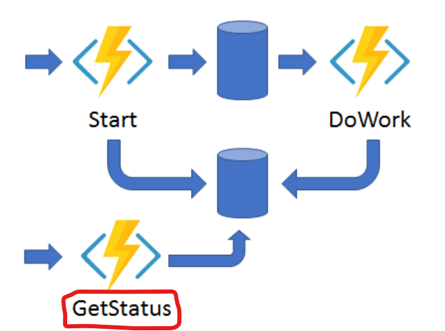
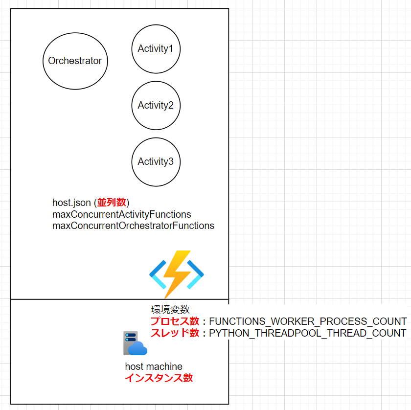
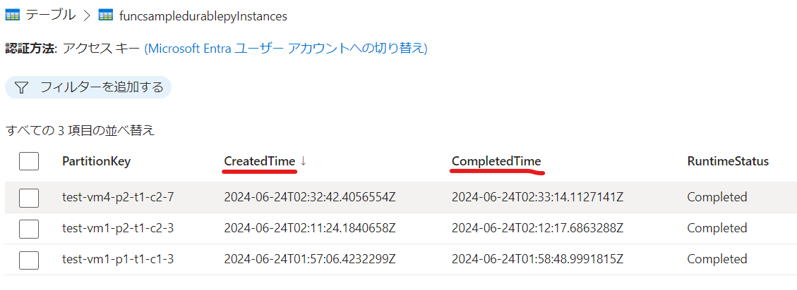

# Azure Functions ([Python]Durable Function)

# はじめに

こんにちは。ACS 事業部の奥山です。

Azure Functions の Durable Functions (Python) についての調査・検証を行ったので、備忘録を兼ねてブログにしておきます。

現在、担当しているシステムで時間のかかる処理を行う必要があり、調べた内容です。
様々な実現方法があるとは思いますが、Azure なら Durable Functions お勧めです。

## Durable Functions (Azure Functions) とは

Microsoftが開発した Durable Taskフレームワーク を基に構築された Azure Functionsの拡張機能になります。ステートフルな処理 や 長期実行プロセス を簡単に作成できます。 Microsoft内でも様々なところで利用されています。

(参考) 以前に書いたブログ[Azure Durable Functionsを使ってみた](https://techblog.ap-com.co.jp/entry/2022/06/02/170053)

# Pythonでの実装について

Azure Functions Pythonでのプログラミングには プログラミング モデル v1 と v2 があります。
v1 と v2 の最も大きな違いは functions.json を利用するかどうかですかね。 v2 では functions.json がなくなりデコレーターでバインディング等の設定を指定することになり、コード中心になります。

※ 今回は v2 で検証を進めました、実際によく利用しそうなものを以下に紹介します。


## (1) Blueprints (フォルダ構成を変更)

フォルダ構成を推奨フォルダー構造を参考に、ブループリントを利用して少し機能単位にフォルダを分けました。

```
$ tree 
.
├── __pycache__
│   ├── func1_blueprint.cpython-310.pyc
│   └── function_app.cpython-310.pyc
├── blog.md
├── func01 ※一つ目の機能
│   ├── __pycache__
│   │   └── func1_blueprint.cpython-310.pyc
│   └── func1_blueprint.py
├── func02 ※二つ目の機能
│   ├── __pycache__
│   │   └── func2_blueprint.cpython-310.pyc
│   └── func2_blueprint.py
├── function_app.py
├── host.json
├── local.settings.json
└── requirements.txt
```

## (2) シングルトン オーケストレーター

[こちら](https://learn.microsoft.com/ja-jp/azure/azure-functions/durable/durable-functions-singletons?tabs=python)で紹介されている特定のオーケストレーターを1度に一つだけ実行されるように保障するパターン。
オーケストレーターのID（インスタンスID）を固定しておいて実行中かどうかを確認します。実装はシンプルでわかりやすいですね。

```python
# An HTTP-Triggered Function with a Durable Functions Client binding
@bp.route(route="orchestrators2/{functionName}")
@bp.durable_client_input(client_name="client")
async def http_start2(req: func.HttpRequest, client):

    # シングルトン オーケストレーター
    instance_id = req.params.get('myId', 'my-id-2024001')
    log_thread_info(f"http_start2: instance_id {instance_id}")
    existing_instance = await client.get_status(instance_id)
    if existing_instance.runtime_status in [df.OrchestrationRuntimeStatus.Completed, df.OrchestrationRuntimeStatus.Failed, df.OrchestrationRuntimeStatus.Terminated, None]:
        taskCount = int(req.params.get('taskCount', '100'))
        function_name = req.route_params.get('functionName')

        log_thread_info(f"http_start2: taskCount {taskCount}")
        instance_id = await client.start_new(function_name, instance_id, taskCount)
        response = client.create_check_status_response(req, instance_id)
    else:
        # すでに実行中の場合は、そのまま返す
        response = client.create_check_status_response(req, instance_id)
    return response
```

## (3) アプリケーション パターン #3: 非同期 HTTP API

時間のかかる処理に有効なのが [アプリケーション パターン #3: 非同期 HTTP API](https://learn.microsoft.com/ja-jp/azure/azure-functions/durable/durable-functions-overview?tabs=in-process%2Cnodejs-v3%2Cv2-model&pivots=python#async-http) です。




実装自体は 通常の durable functions と同様です。
何もしなくてもオーケストレーター関数の状態をクエリするWebhook HTTP APIが組み込み処理が利用できます。※赤枠のところ


### 状態をクエリする 組み込みの Webhook HTTP API

※ [インスタンスの管理](https://learn.microsoft.com/ja-jp/azure/azure-functions/durable/durable-functions-instance-management?tabs=python) を参照

Webhook HTTP API の URL はHTTP-Triggered関数の場合、RESTのResponseに含まれています。
```
response = client.create_check_status_response(req, instance_id)
```

レスポンスを確認すると以下のように URL が確認できます。
```bash
$ curl -sS http://localhost:7071/api/orchestrators/hello_orchestrator   | jq . 
{
  "id": "59258d16b93544338469fd8d954b5e9d",
  "statusQueryGetUri": "http://localhost:7071/runtime/webhooks/durabletask/instances/<id>",
  "sendEventPostUri": "http://localhost:7071/runtime/webhooks/durabletask/instances/<id>/raiseEvent/{eventName}",
  "terminatePostUri": "http://localhost:7071/runtime/webhooks/durabletask/instances/<id>/terminate",
  "rewindPostUri": "http://localhost:7071/runtime/webhooks/durabletask/instances/<id>/rewind",
  "purgeHistoryDeleteUri": "http://localhost:7071/runtime/webhooks/durabletask/instances/<id>",
  "restartPostUri": "http://localhost:7071/runtime/webhooks/durabletask/instances/<id>/restart",
  "suspendPostUri": "http://localhost:7071/runtime/webhooks/durabletask/instances/<id>/suspend",
  "resumePostUri": "http://localhost:7071/runtime/webhooks/durabletask/instances/<id>/resume"
}
```

### Runtime Status

Client はポーリングによって操作が完了したことを認識することができます。
ClientはAPIを通してオーケストレーションの状態をしることができます。

|RuntimeStatus|意味|
| --- | --- |
| Pending | スケジュール済み |
| Running | 実行中 |
| Completed | 完了　|
| ContinuedAsNew | インスタンスが新しい履歴で自身を再開しました。 これは一時的な状態です。 |
| Failed | 失敗 |
| Terminated | 停止 |
| Suspended | 再開(resume)待ち |

## (4) スケーリングとパフォーマンスの調整

プログラミング言語の特性や実際の処理の特性に応じて以下のパラメータを調整します。



| パラメータ | 説明 | 備考(変更方法) |
|--- | --- | --- |
| インスタンス数 | vmの数 | ※スケールアウト |
| プロセス数 | FUNCTIONS_WORKER_PROCESS_COUNT (default: 1) | 環境変数 |
| スレッド数 | PYTHON_THREADPOOL_THREAD_COUNT (default: None ※実行中に設定されるスレッドの数を保証しない) | 環境変数 |
| 並列処理の数(Activity) | maxConcurrentActivityFunctions | host.json (extensions.durableTask) ※1つのワーカーが処理する数を設定|
| 並列処理の数(Orchestrator) | maxConcurrentOrchestratorFunctions | host.json (extensions.durableTask) ※1つのワーカーが処理する数を設定|

※上記パラメータを実際に動作させながら調整していくことになります。

(参考)
[Azure Functions で Python アプリのスループット パフォーマンスを向上させる](https://learn.microsoft.com/ja-jp/azure/azure-functions/python-scale-performance-reference) 


### 並列処理の確認

Activityで1秒のSleep処理を実施し並列数を上げることで全体の処理時間が短縮されることを確認します。  
※Activityはファンアウト・ファンインのシナリオで最大10並列で処理されるように実装しています。

簡単ですが以下の3パターンの動作確認した結果は以下の様になりました。  

※重量課金プランで実施  
※並列数 は maxConcurrentActivityFunctions と maxConcurrentOrchestratorFunctions に同じ値を設定  
※ PYTHON_THREADPOOL_THREAD_COUNT は 1固定  

| インスタンス数 | 並列数 | process数 | 処理時間 |
|--- | --- | --- | --- |
| 1 | 1 | 1 | 約100秒 |
| 1 | 2 | 2 | 約50秒 |
| 4 | 2 | 2 | 約30秒 |

※処理時間の確認は Azure Storage の table で確認しています。


パラメータの変更で並列に処理されて全体の処理時間が短くなっていることを確認できました。

# まとめ

簡単ですが、今回は Azure Functions (Durable Functions) の   
・Pythonでの実装  
・非同期 HTTP API  
・スケーリングとパフォーマンスの調整  
の紹介でした。


# 最後に

私達 ACS 事業部は Azure・AKS を活用した内製化のご支援をしております。ご相談等ありましたらぜひご連絡ください。

[https://www.ap-com.co.jp/cloudnative/?utm_source=blog&utm_medium=article_bottom&utm_campaign=cloudnative:embed:cite]

また、一緒に働いていただける仲間も募集中です！  
切磋琢磨しながらスキルを向上できる、エンジニアには良い環境だと思います。ご興味を持っていただけたら嬉しく思います。

[https://www.ap-com.co.jp/recruit/info/requirements.html?utm_source=blog&utm_medium=article_bottom&utm_campaign=recruit:embed:cite]

<fieldset style="border:4px solid #95ccff; padding:10px">
本記事の投稿者: [奥山 拓弥](https://techblog.ap-com.co.jp/archive/author/mountain1415)  
</fieldset>


host.json
```
"extensions": {
    "durableTask": {
      "maxConcurrentActivityFunctions": 2,
      "maxConcurrentOrchestratorFunctions": 2
    }
```

evn
```
FUNCTIONS_WORKER_PROCESS_COUNT 
PYTHON_THREADPOOL_THREAD_COUNT 
```

mysql
engine.pyの処理で利用しているライブラリ

[2024-06-17T08:52:16.672Z] F2 input: 79 start, hostname: IT-PC-2402-1092, pID: 3656399 thID: 140361662715456
[2024-06-17T08:52:16.672Z] F2 input: 119 start, hostname: IT-PC-2402-1092, pID: 3656450 thID: 140220934641216
[2024-06-17T08:52:16.690Z] F2 input: 139 start, hostname: IT-PC-2402-1092, pID: 3656399 thID: 140361654322752
[2024-06-17T08:52:16.713Z] F2 input: 109 start, hostname: IT-PC-2402-1092, pID: 3656450 thID: 140219986708032
[2024-06-17T08:52:16.730Z] F2 input: 129 start, hostname: IT-PC-2402-1092, pID: 3656399 thID: 140361645930048
[2024-06-17T08:52:16.749Z] F2 input: 99 start, hostname: IT-PC-2402-1092, pID: 3656450 thID: 140219978315328
[2024-06-17T08:52:16.773Z] F2 input: 169 start, hostname: IT-PC-2402-1092, pID: 3656399 thID: 140361637537344
[2024-06-17T08:52:16.794Z] F2 input: 159 start, hostname: IT-PC-2402-1092, pID: 3656450 thID: 140219969922624
[2024-06-17T08:52:16.821Z] F2 input: 179 start, hostname: IT-PC-2402-1092, pID: 3656399 thID: 140361629144640
[2024-06-17T08:52:16.843Z] F2 input: 149 start, hostname: IT-PC-2402-1092, pID: 3656450 thID: 140219961529920


04Z] Executed 'Functions.hello_orchestrator2' (Succeeded, Id=4992f719-5892-4b2e-84bd-2a24abdd7fcc, Duration=11ms)
[2024-06-17T08:55:03.111Z] F2 input: 146 start, hostname: IT-PC-2402-1092, pID: 3657847 thID: 140199384286784
[2024-06-17T08:55:03.138Z] F2 input: 161 start, hostname: IT-PC-2402-1092, pID: 3657887 thID: 140043532310080
[2024-06-17T08:55:03.160Z] F2 input: 151 start, hostname: IT-PC-2402-1092, pID: 3658035 thID: 140386710320704
[2024-06-17T08:55:03.180Z] F2 input: 156 start, hostname: IT-PC-2402-1092, pID: 3657847 thID: 140199375894080
[2024-06-17T08:55:03.203Z] F2 input: 171 start, hostname: IT-PC-2402-1092, pID: 3658176 thID: 140253222364736
[2024-06-17T08:55:03.227Z] F2 input: 176 start, hostname: IT-PC-2402-1092, pID: 3657887 thID: 140043549095488
[2024-06-17T08:55:03.248Z] F2 input: 186 start, hostname: IT-PC-2402-1092, pID: 3658035 thID: 140385976272448
[2024-06-17T08:55:03.273Z] F2 input: 181 start, hostname: IT-PC-2402-1092, pID: 3658176 thID: 140253213972032
[2024-06-17T08:55:03.291Z] F2 input: 191 start, hostname: IT-PC-2402-1092, pID: 3657887 thID: 140043557488192
[2024-06-17T08:55:03.310Z] F2 input: 196 start, hostname: IT-PC-2402-1092, pID: 3658035 thID: 140385951094336
[2024-06-17T08:55:04.113Z] F2 input: 147 start, hostname: IT-PC-2402-1092, pID: 3657847 thID: 140199384286784
[2024-06-17T08:55:04.140Z] F2 input: 162 start, hostname: IT-PC-2402-1092, pID: 3657887 thID: 140043532310080
[2024-06-17T08:55:04.161Z] F2 input: 152 start, hostname: IT-PC-2402-1092, pID: 3658035 thID: 140386710320704
[2024-06-17T08:55:04.183Z] F2 input: 157 start, hostname: IT-PC-2402-1092, pID: 3657847 thID: 140199375894080
[2024-06-17T08:55:04.204Z] F2 input: 172 start, hostname: IT-PC-2402-1092, pID: 3658176 thID: 140253222364736
[2024-06-17T08:55:04.228Z] F2 input: 177 start, hostname: IT-PC-2402-1092, pID: 3657887 thID: 140043549095488
[2024-06-17T08:55:04.250Z] F2 input: 187 start, hostname: IT-PC-2402-1092, pID: 3658035 thID: 140385976272448
[2024-06-17T08:55:04.275Z] F2 input: 182 start, hostname: IT-PC-2402-1092, pID: 3658176 thID: 140253213972032
[2024-06-17T08:55:04.293Z] F2 input: 192 start, hostname: IT-PC-2402-1092, pID: 3657887 thID: 140043557488192
[2024-06-17T08:55:04.311Z] F2 input: 197 start, hostname: IT-PC-2402-1092, pID: 3658035 thID: 140385951094336
[2024-06-17T08:55:05.114Z] F2 input: 148 start, hostname: IT-PC-2402-1092, pID: 3657847 thID: 140199384286784
[2024-06-17T08:55:05.141Z] F2 input: 163 start, hostname: IT-PC-2402-1092, pID: 3657887 thID: 140043532310080
[2024-06-17T08:55:05.162Z] F2 input: 153 start, hostname: IT-PC-2402-1092, pID: 3658035 thID: 140386710320704
[2024-06-17T08:55:05.184Z] F2 input: 158 start, hostname: IT-PC-2402-1092, pID: 3657847 thID: 140199375894080
[2024-06-17T08:55:05.205Z] F2 input: 173 start, hostname: IT-PC-2402-1092, pID: 3658176 thID: 140253222364736
[2024-06-17T08:55:05.229Z] F2 input: 178 start, hostname: IT-PC-2402-1092, pID: 3657887 thID: 140043549095

