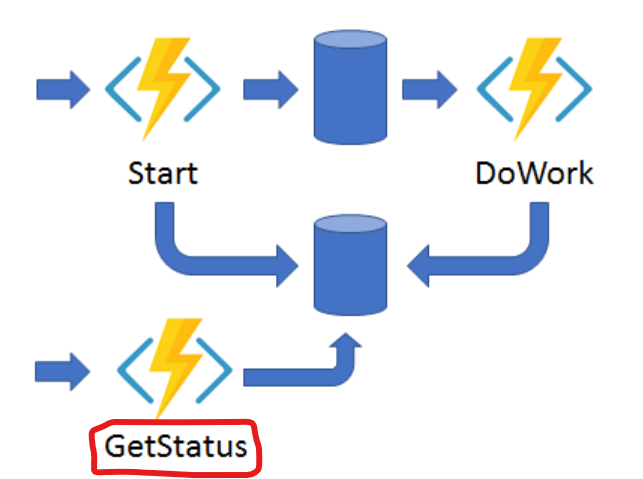

# Github Copilot Lab

# はじめに

こんにちは。ACS 事業部の奥山です。

Azure Functions の Durable Functions (Python) についての調査・検証を行ったので、備忘録を兼ねてブログにしておきます。

現在、担当しているシステムで時間のかかる処理を行う必要があり、調べた内容です。
様々な実現方法があるとは思いますが、Azure なら Durable Functions お勧めです！

## Durable Functions (Azure Functions) とは

以前に Durable Functions について[ブログ](https://techblog.ap-com.co.jp/entry/2022/06/02/170053)を書いたブログを紹介


# Pythonでの実装について

※このブログでは実際のソースコードなどは記載しません。

Azure Functions Pythonでのプログラミングには プログラミング モデル v1 と v2 があります。
v1 と v2 の最も大きな違いは functions.json を利用するかどうかですかね。 v2 では functions.json がなくなりデコレーターでバインディング等の設定を指定することになり、コード中心になります。
※ 今回は v2 で実装を進めています。

## pythonでの実装 (最低限のはじめかた)

[Azure Functions の Python 開発者向けガイド](https://learn.microsoft.com/ja-jp/azure/azure-functions/functions-reference-python?tabs=asgi%2Capplication-level&pivots=python-mode-decorators)


## Blueprints (フォルダ構成を変更)

フォルダ構成を推奨フォルダー構造を参考に、ブループリントを利用して少し機能単位にフォルダを分けました。

```
$ tree 
.
├── __pycache__
│   ├── func1_blueprint.cpython-310.pyc
│   └── function_app.cpython-310.pyc
├── blog.md
├── func01 ※一つ目の機能
│   ├── __pycache__
│   │   └── func1_blueprint.cpython-310.pyc
│   └── func1_blueprint.py
├── func02 ※二つ目の機能
│   ├── __pycache__
│   │   └── func2_blueprint.cpython-310.pyc
│   └── func2_blueprint.py
├── function_app.py
├── host.json
├── local.settings.json
└── requirements.txt
```


# アプリケーション パターン #3: 非同期 HTTP API

時間のかかる処理に有効なのが [アプリケーション パターン #3: 非同期 HTTP API](https://learn.microsoft.com/ja-jp/azure/azure-functions/durable/durable-functions-overview?tabs=in-process%2Cnodejs-v3%2Cv2-model&pivots=python#async-http) です。




実装自体は 通常の durable functions と同様です。
何もしなくてもオーケストレーター関数の状態をクエリするWebhook HTTP APIが組み込み処理が利用できます。※赤枠のところ


## 状態をクエリするWebhook HTTP API

※ [インスタンスの管理](https://learn.microsoft.com/ja-jp/azure/azure-functions/durable/durable-functions-instance-management?tabs=python) を参照

Webhook HTTP API の URL はHTTP-Triggered関数の場合、RESTのResponseに含まれています。
```
response = client.create_check_status_response(req, instance_id)
```

レスポンスを確認すると以下のように URL が確認できます。
```bash
$ curl -sS http://localhost:7071/api/orchestrators/hello_orchestrator   | jq . 
{
  "id": "59258d16b93544338469fd8d954b5e9d",
  "statusQueryGetUri": "http://localhost:7071/runtime/webhooks/durabletask/instances/<id>",
  "sendEventPostUri": "http://localhost:7071/runtime/webhooks/durabletask/instances/<id>/raiseEvent/{eventName}",
  "terminatePostUri": "http://localhost:7071/runtime/webhooks/durabletask/instances/<id>/terminate",
  "rewindPostUri": "http://localhost:7071/runtime/webhooks/durabletask/instances/<id>/rewind",
  "purgeHistoryDeleteUri": "http://localhost:7071/runtime/webhooks/durabletask/instances/<id>",
  "restartPostUri": "http://localhost:7071/runtime/webhooks/durabletask/instances/<id>/restart",
  "suspendPostUri": "http://localhost:7071/runtime/webhooks/durabletask/instances/<id>/suspend",
  "resumePostUri": "http://localhost:7071/runtime/webhooks/durabletask/instances/<id>/resume"
}
```

## Runtime Status

Client はポーリングによって操作が完了したことを認識することができます。
ClientはAPIを通してオーケストレーションの状態をしることができます。

|RuntimeStatus|意味|
| --- | --- |
| Pending | スケジュール済み |
| Running | 実行中 |
| Completed | 完了　|
| ContinuedAsNew | インスタンスが新しい履歴で自身を再開しました。 これは一時的な状態です。 |
| Failed | 失敗 |
| Terminated | 停止 |
| Suspended | 再開(resume)待ち |

# スケーリングとパフォーマンス

[Azure Functions で Python アプリのスループット パフォーマンスを向上させる](https://learn.microsoft.com/ja-jp/azure/azure-functions/python-scale-performance-reference) に書かれている以下の２つのパラメータを調整して性能をコントロールできます。

[アプリケーション設定](https://learn.microsoft.com/ja-jp/azure/azure-functions/functions-app-settings)

| 設定名 | 備考 |
| --- | --- |
| FUNCTIONS_WORKER_PROCESS_COUNT | 既定値は 1 です。 許容される最大値は 10 |
| PYTHON_THREADPOOL_THREAD_COUNT | スレッド数（初期値はNone）|

## 性能確認用の処理
次のような処理を実行して処理時間を計測してみました。

# 最後に

私達 ACS 事業部は Azure・AKS を活用した内製化のご支援をしております。ご相談等ありましたらぜひご連絡ください。

[https://www.ap-com.co.jp/cloudnative/?utm_source=blog&utm_medium=article_bottom&utm_campaign=cloudnative:embed:cite]

また、一緒に働いていただける仲間も募集中です！  
切磋琢磨しながらスキルを向上できる、エンジニアには良い環境だと思います。ご興味を持っていただけたら嬉しく思います。

[https://www.ap-com.co.jp/recruit/info/requirements.html?utm_source=blog&utm_medium=article_bottom&utm_campaign=recruit:embed:cite]

<fieldset style="border:4px solid #95ccff; padding:10px">
本記事の投稿者: [奥山 拓弥](https://techblog.ap-com.co.jp/archive/author/mountain1415)  
</fieldset>